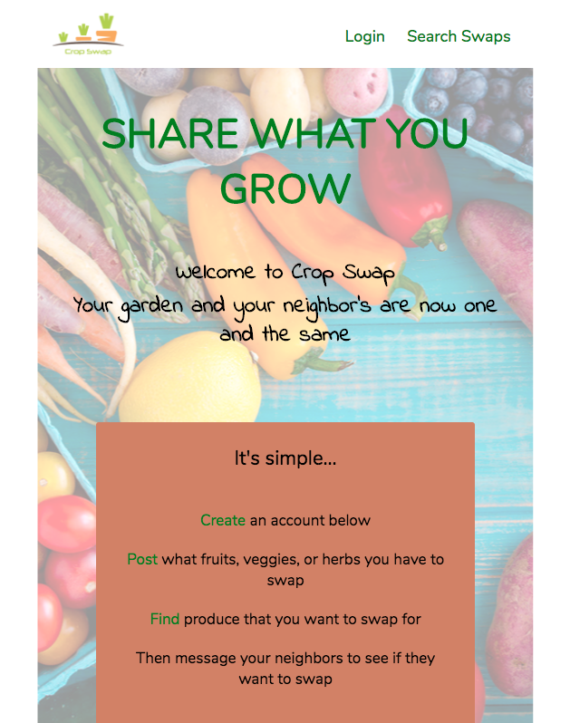
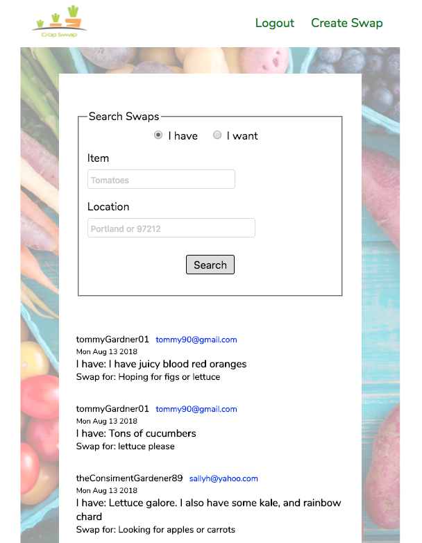
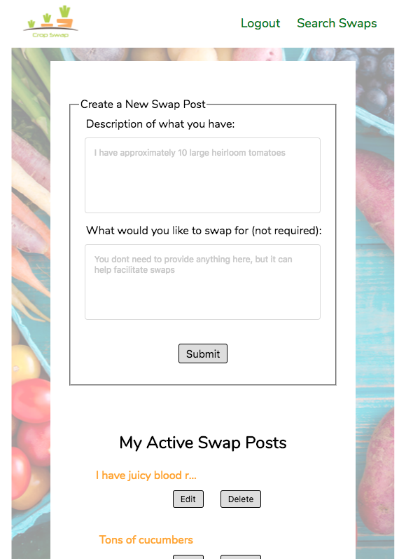

# Crop-Swap
https://crop-swap.herokuapp.com/

# Summary
Crop Swap is designed to help people connect with their neighbors so they can swap excess fruits/veggies/herbs whenever or wherever they like.

# Motivation
I'm a fan of gardening and eating what you grow, but when your what you grow goes gangbusters, it gets old
eating the same thing day in and out, and who wants to waste the food? Once a week people from my neighborhood would get together, bring what excess they have and swap stuff out. I realized if there was away for people to connect on a broader level or on different days, even more swaping could be done.

# Technology used
* JavaScript/ jQuery
* Node/Express
* Mongo/Mongoose
* Travis CI
* Heroku/mLab
* JWT/Passport
* HTML
* CSS

### Home page-----

### Search results page-----

### Create a Swap page-------

